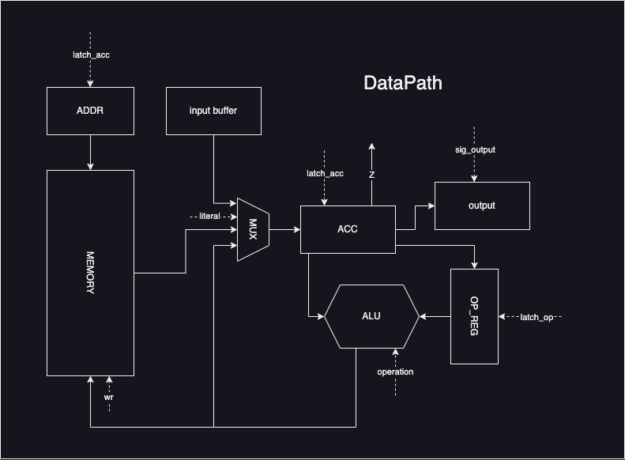
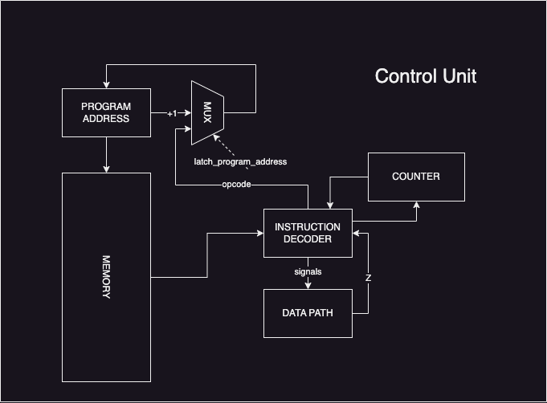

# Lisp. Транслятор и модель

- Шляпников Александр Дмитриевич
- `lisp -> asm | acc | neum | hw | instr | struct | stream | port | pstr | prob1 | cache`
- Базовый вариант.


## Язык программирования

``` ebnf
program ::= term

term ::= symbol
       | comment
       | (term)
       | (term term)

symbol ::= set input print print_int deproc if loop + - / * % and or = != > <

comment ::= <any symbols after: -->
```

Код выполняется последовательно. Операции:

- `(set <name> <value-exp>)`          -- создать или обновить переменную
- `(input <variable name>)`           -- ввести значение и сохранить в текущей ячейке (символ)
- `(print <exp>)`                     -- напечатать значение являющееся результатам вычисления выражения (как символ)
- `(print_int <exp>)`                 -- напечатать значение являющееся результатам вычисления выражения (как число)
- `(deproc <name> <body-exp1..N>)`    -- объявить процедуру с именем <name> и телом <body-exp1..N> 
- `(if <cond> <body-exp1..N>)`        -- условное выражение если <cond> сделать <body-exp1..N> 
- `(loop <end-cond> <body-exp1..N>)`  -- цикл с предусловием пока \<cond> выполнять <body-exp1..N>
- `(+ <var \ val> <var \ val> ...)`   -- последовательное суммирование всех операндов, результат можно использовать как \<exp>
- `(- <var \ val> <var \ val> ...)`   -- последовательное вычитание всех операндов, результат можно использовать как \<exp>
- `(/ <var \ val> <var \ val> ...)`   -- последовательное деление всех операндов, результат можно использовать как \<exp>
- `(* <var \ val> <var \ val> ...)`   -- последовательное умножение всех операндов, результат можно использовать как \<exp>
- `(% <var \ val> <var \ val> ...)`   -- последовательное взятие остатка всех операндов, результат можно использовать как \<exp>
- `(and <var \ val> <var \ val> ...)` -- последовательное логическое И всех операндов, результат можно использовать как \<exp>
- `(or <var \ val> <var \ val> ...)`  -- последовательное логическое ИЛИ всех операндов, результат можно использовать как \<exp>
- `(= <var \ val> <var \ val> ...)`   -- проверка, что все операнды равны, результат можно использовать как \<exp>
- `(!= <var \ val> <var \ val> ...)`  -- проверка, что все операнды не равны, результат можно использовать как \<exp>
- `(> <var \ val> <var \ val> ...)`   -- проверка, что все операнды последовательно уменьшаются, результат можно использовать как \<exp>
- `(< <var \ val> <var \ val> ...)`   -- проверка, что все операнды последовательно растут, результат можно использовать как \<exp>
- `-- <any symbols \ text \ etc>`     -- комментарий

Все операторы, а также операции принимающие на вход <exp> поддерживают потенциально любой уровень вложенности (при достатке памяти)

Операторы, а также инструкции `deproc`, `if` и `loop` поддерживают любое кол-во exp

` (+ 1 (+ 2 3) (and 2 3)) ` - корректный код

` (deproc proc1 (set a 2) (set b (+ 1 (+ 2 3) (and 2 3)) )` - корректный код


Операция не может быть использована как операнд input и поддерживает только чтение в переменную, но умеет сама их создавать

НЕ корректный код:
`(print input)` 

Корректный код:

`(input a)`

`(print a)` 


Память выделяется статически, при запуске модели.

Видимость данных -- глобальная.

Поддержка литералов -- присутсвует.

`(set b 1000)` 
`(set c "C")`

При необходимости работать со статистическими строками можно использовать последовательность выражений

`(print "H" "e" "l" "l" "o")` --> **stdout:** Hello

Пробелы в строках поддерживаются через плейсхолдер \s:

`(print "H" "e" "l" "l" "o" "\s" "w" "o" "r" "l" "d")` --> **stdout:** Hello world

## Организация памяти

Модель памяти процессора:

Память команд и данных находятся в едином адресном пространстве (не разделены)
Команды хранятся как список словарей описывающих инструкции
Данные хранятся как список чисел

При трансляции в машинный код динамически выделяется область памяти для хранения промежуточных значений вложенных операторов, а также литералов и переменных 

Литералы сохраняются в статическую память всегда и адресуются также как переменные

Исполнение начинается с нулевой ячейки с которой идёт безусловный переход к первой "значимой" инструкции

Так как в языке поддержка строк реализована через последовательность символов сохраняться они будут последовательно каждый символ - одно машинное слово

В случае переполнения регистров доступной памяти в начале выполнения будет выброшено исключение

```
       Memory
+------------------------------+
|   00    : JP L+V+T           |
|   01    : literals           |
|      ...                     |
|    L    : variables          |
|      ...                     |
|  L + V  : operands_temp      |
|      ...                     |
|L + V + T: first program instr|
|      ...                     |
+------------------------------+
```

## Система команд

Особенности процессора:

- Машинное слово -- 16 бит, знаковое.
- Доступ к памяти данных осуществляется по адресу, хранящемуся в специальном регистре `data_address`. 
- Напрямую установка адреса недоступна, осуществляется неявно внутри команд операторов, команд переходов и внутри команд загрузки, выгрузки памяти.
- Возможна загрузка литералов напрямую в аккумулятор при помощи инструкции `LIT`
- Обработка данных происходит при помощи операторов `ADD`, `SUB`, `MUL`, `DIV`, `MOD`, `AND`, `OR`, `EQ`, `NEQ`, `GR`, `LW` каждый из них принимает на вход адрес второго операнда (первый - аккумулятор), а также команд загрузки выгрузки памяти `LD`, `ST`
- Поток управления:
    - инкремент `PC` после каждой инструкции;
    - условный (`JPZ`) и безусловный (`JP`) переходы 

### Набор инструкций

| Инструкция         | Кол-во тактов | Описание                                                                           |
|:-------------------|:--------------|:-----------------------------------------------------------------------------------|
| LIT `<literal>`    | 1             | Загрузить литерал в аккумулятор                                                    |
| LD `<addr>`        | 1             | Загрузить в аккумулятор значение из ячейки по адресу `<addr>`                      |
| ST `<addr>`        | 1             | Сохранить значение из аккумулятора в ячейке по адресу `<addr>`                     |
| ADD `<addr>`       | 3             | Выполнить операцию сложения аккумулятора с значение ячейки по адресу `addr`        |
| SUB `<addr>`       | 3             | Выполнить операцию вычитания аккумулятора с значение ячейки по адресу `addr`       |
| MUL `<addr>`       | 3             | Выполнить операцию умножения аккумулятора с значение ячейки по адресу `addr`       |
| DIV `<addr>`       | 3             | Выполнить операцию деления аккумулятора с значение ячейки по адресу `addr`         |
| MOD `<addr>`       | 3             | Выполнить операцию взятия остатка аккумулятора с значение ячейки по адресу `addr`  |
| AND `<addr>`       | 3             | Выполнить операцию логического И аккумулятора с значение ячейки по адресу `addr`   |
| OR `<addr>`        | 3             | Выполнить операцию логического ИЛИ аккумулятора с значение ячейки по адресу `addr` |
| EQ `<addr>`        | 3             | Проверить равенство аккумулятора с значение ячейки по адресу `addr`                |
| NEQ `<addr>`       | 3             | Проверить не равенство аккумулятора с значение ячейки по адресу `addr`             |
| GR `<addr>`        | 3             | Сравнить значение аккумулятора с значение ячейки по адресу `addr`                  |
| LW `<addr>`        | 3             | Сравнить значение аккумулятора с значение ячейки по адресу `addr`                  |
| IN `<port>`        | 1             | Сохранить значение из порта `port` в аккумуляторе                                  |
| OUT `<port>`       | 1             | Подать на выход значение в аккумуляторе на порт `port` (строка)                    |
| OUT_PURE `<port>`  | 1             | Подать на выход значение в аккумуляторе на порт `port` (напрямую, как число)       |
| jmp `<addr>`       | 1             | безусловный переход                                                                |
| jz `<addr>`        | 1             | переход, если в аккумуляторе 0                                                     |
| HLT                | -             | остановить тактовый генератор                                                      |

- `<addr>` -- исключительно непосредственная адресация памяти команд.

### Кодирование инструкций

- Машинный код сериализуется в список команд.
- Один строка списка -- одна инструкция.
- Строки считаются с 0
- Номер строки -- адрес инструкции. Используется для команд перехода.

Пример:

```asm
  JP 4 
  NOP  
  NOP  
  NOP  
  LIT 0 
  ST 2 
  LD 2 
  ST 3 
  IN 1 
```

## Транслятор

Интерфейс командной строки: `translator.py <input_file> <target_file>`

Реализовано в модуле: [translator](./translator.py)

Этапы трансляции (функция `main`):

1. Очистка комментариев и лишних пробелов
2. Парсинг исходного кода (см. [parser](./parser.py)) и преобразование его в дерево объектов Instruction (см. [instruction](./instruction.py))
3. Использование дерева для генерации машинного кода.

Правила генерации машинного кода:

- Процедуры поддерживаются только на уровне языка, в машинном коде происходит инлайнинг всех инструкций внутри тела функции
- Вложенные математические операции выполняются последовательно изнутри наружу, каждый этап вложенности вычисляется отдельно и сохраняется в переменную. После вычисления всех уровней идёт последовательное применение оператора к полученному списку вычисленных значений
- Команды IN и OUT не взаимодействуют напрямую с памятью, все данные сохраняются \ берутся в \ из аккумулятора.
- Переменные также, как и литералы отображаются на память статически, адреса рассчитываются при трансляции и больше не меняются

## Модель процессора

Интерфейс командной строки: `machine.py <machine_code_file> <input_file>`

Реализовано в модуле: [machine](./machine.py).

### DataPath



Реализован в классе `DataPath`.

`memory` -- однопортовая память, поэтому либо читаем, либо пишем.

Сигналы (обрабатываются за один такт, реализованы в виде методов класса):

- `latch_addr` -- защёлкнуть выбранное значение в `data_addr`;
  - адрес приходит как управляющий сигнал ControlUnit
- `latch_acc` -- защёлкнуть в аккумулятор выбранное значение;
  - выход из памяти
  - литерал
  - результат операции в алу
  - значение из порта ввода (если буфер пустой -- выбрасывается исключение)
- `wr` -- записать значение аккумулятора в память:
- `output` -- записать аккумулятор в порт вывода.
  - Строкой
  - Числом

Флаги:

- `zero` -- отражает наличие нулевого значения в аккумуляторе.

### ControlUnit



Реализован в классе `ControlUnit`.

- `program_address` - регистр указатель на исполняемую инструкцию в памяти

- Hardwired (реализовано полностью на Python).
- Метод `decode_and_execute_instruction` моделирует выполнение полного цикла инструкции (1-3 такта процессора).
- Counter реализован неявно внутри метода `decode_and_execute_instruction`

Сигнал:

- `latch_program_address` -- сигнал для обновления счётчика команд в ControlUnit.
  - +1
  - Адрес из команды

Особенности работы модели:

- Цикл симуляции осуществляется в функции `simulate`.
- Шаг моделирования соответствует одной инструкции с выводом состояния в журнал.
- Для журнала состояний процессора используется стандартный модуль `logging`.
- Количество инструкций для моделирования лимитировано.
- Остановка моделирования осуществляется при:
    - превышении лимита количества выполняемых инструкций;
    - превышении лимита памяти
    - исключении `EOFError` -- если нет данных для чтения из порта ввода;
    - исключении `StopMachine` -- если выполнена инструкция `halt`.
    - исключении `MemoryCorrupted` -- если ControlUnit прочитал память данных вместо инструкции.

## Тестирование

Тестирование выполняется при помощи golden test-ов.

Тесты реализованы в: [golden_bf_test.py](./golden_test.py). 

Конфигурации:
- [golden/cat.yml](golden/cat_common.yml)
- [golden/hello.yml](golden/hello_common.yml)
- [golden/hello_user.yml](golden/hello_user_common.yml)
- [golden/prob1.yml](golden/prob1.yml)

Запустить тесты: `poetry run pytest . -v`

Обновить конфигурацию golden tests:  `poetry run pytest . -v --update-goldens`

CI при помощи Github Action: [.github/workflows/lisp.yml](.github/workflows/lisp.yml)

Пример использования и журнал работы процессора на примере `hello`:

``` shell
╭─dudosyka@MacBook-Pro-Alex-4 ~/PycharmProjects/lisp ‹master●› 
╰─$ cat input.txt
(print "H" "e" "l" "l" "o" "\s" "w" "o" "r" "l" "d")
╭─dudosyka@MacBook-Pro-Alex-4 ~/PycharmProjects/lisp ‹master●› 
╰─$ python3 translator.py ~/PycharmProjects/lisp/input.txt ~/PycharmProjects/lisp/output.txt
source LoC: 1 code instr: 49
╭─dudosyka@MacBook-Pro-Alex-4 ~/PycharmProjects/lisp ‹master●› 
╰─$ cat output.txt
JP 10 
NOP  
NOP  
NOP  
NOP  
NOP  
NOP  
NOP  
NOP  
NOP  
LIT 72 
ST 2 
LIT 101 
ST 3 
LIT 108 
ST 4 
LIT 111 
ST 5 
LIT 32 
ST 6 
LIT 119 
ST 7 
LIT 114 
ST 8 
LIT 100 
ST 9 
LD 2 
OUT 0 
LD 3 
OUT 0 
LD 4 
OUT 0 
LD 4 
OUT 0 
LD 5 
OUT 0 
LD 6 
OUT 0 
LD 7 
OUT 0 
LD 5 
OUT 0 
LD 8 
OUT 0 
LD 4 
OUT 0 
LD 9 
OUT 0 
HLT  
╭─dudosyka@MacBook-Pro-Alex-4 ~/PycharmProjects/lisp ‹master●› 
╰─$ python3 machine.py output.txt ./input_buffer.txt 
Hello world
```

Пример проверки исходного кода:

``` shell
╭─dudosyka@MacBook-Pro-Alex-4 ~/PycharmProjects/lisp ‹master●› 
╰─$ poetry run pytest . -v
=========================================================================================================================================== test session starts ===========================================================================================================================================
platform darwin -- Python 3.12.3, pytest-7.4.4, pluggy-1.5.0 -- /Users/dudosyka/Library/Caches/pypoetry/virtualenvs/lisp-i1ZuaGSg-py3.12/bin/python
cachedir: .pytest_cache
rootdir: /Users/dudosyka/PycharmProjects/lisp
configfile: pyproject.toml
plugins: golden-0.2.2
collected 4 items                                                                                                                                                                                                                                                                                         

golden_test.py::test_translator_and_machine[golden/prob1.yml] PASSED                                                                                                                                                                                                                                [ 25%]
golden_test.py::test_translator_and_machine[golden/cat.yml] PASSED                                                                                                                                                                                                                                  [ 50%]
golden_test.py::test_translator_and_machine[golden/hello.yml] PASSED                                                                                                                                                                                                                                [ 75%]
golden_test.py::test_translator_and_machine[golden/hello_user.yml] PASSED                                                                                                                                                                                                                           [100%]

============================================================================================================================================ 4 passed in 4.81s ============================================================================================================================================
╭─dudosyka@MacBook-Pro-Alex-4 ~/PycharmProjects/lisp ‹master●› 
╰─$ poetry run ruff check .
╭─dudosyka@MacBook-Pro-Alex-4 ~/PycharmProjects/lisp ‹master●› 
╰─$ poetry run ruff format .
7 files left unchanged
```

```text
| ФИО                            | алг        | LoC  | code байт | code инстр. | инстр.    | такт.    | вариант |
| Шляпников Александр Дмитриевич | hello      | 1    | -         | 39          | 39        | 39       | -       |
| Шляпников Александр Дмитриевич | cat        | 5    | -         | 17          | 34        | 40       | -       |
| Шляпников Александр Дмитриевич | hello_user | 7    | -         | 114         | 140       | 148      | -       |
| Шляпников Александр Дмитриевич | prob1      | 14   | -         | 54          | 29423     | 48359    | -       |
```